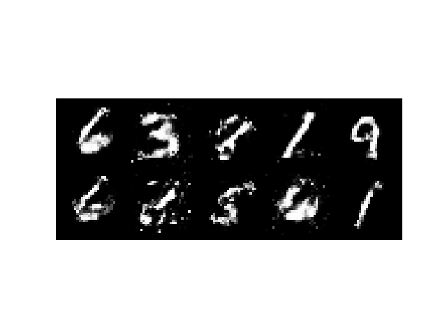
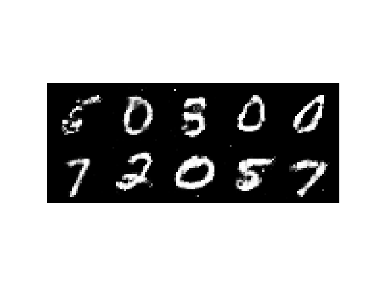
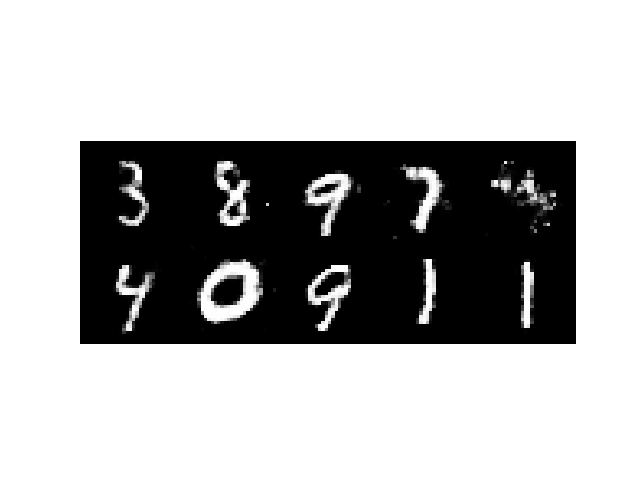
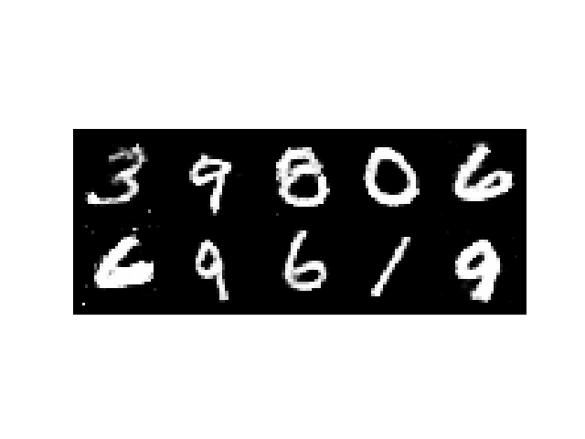

# Conditional GAN for MNIST Image Generation

This project implements a Conditional Generative Adversarial Network (CGAN) for generating images of handwritten digits (0-9) from the MNIST dataset. The model is conditioned on class labels, allowing you to generate images of a specific digit.

## Table of Contents
- [Requirements](#requirements)
- [Model Overview](#model-overview)
  - [Generator](#generator)
  - [Discriminator](#discriminator)
- [Dataset](#dataset)
- [Training](#training)
- [Results](#results)
  - [Generated Images](#generated-images)
- [Usage](#usage)
  - [Generating a Specific Image](#generating-a-specific-image)
  - [Model Saving and Loading](#model-saving-and-loading)

## Requirements

- Python 3.7+
- PyTorch
- torchvision
- matplotlib

To install the required packages, you can run:

```bash
pip install torch torchvision matplotlib

```
# Model Overview

### Generator
- **Input**: Random noise (`latent_dim=100`), Class label (0-9)
- **Architecture**: Dense layers with LeakyReLU
- **Output**: 28x28 image

### Discriminator
- **Input**: 28x28 image, Class label (0-9)
- **Architecture**: Dense layers with LeakyReLU and dropout
- **Output**: Probability (real or fake)

# Dataset

The MNIST dataset (60,000 training, 10,000 testing images) is used and normalized to a range of [-1, 1].

# Training

Run the training script:

```bash
python train.py

```

Training runs for 150 epochs, saving the model every 30 epochs.

# Results

### Generated Images (Epoch 30)



### Generated Images (Epoch 60)



### Generated Images (Epoch 90)



### Generated Images (Epoch 150)



# Usage

Generate an image of a specific label after training:

```python
from model import Generator, generate_image

generator = Generator(latent_dim=100)
generator.load_state_dict(torch.load('models/generator_epoch_150.pth'))

generate_image(generator, latent_dim=100, label=5)

```

# Model Saving and Loading

Models are saved every 30 epochs during training.  

Load models using the `load_model` function in the script.
